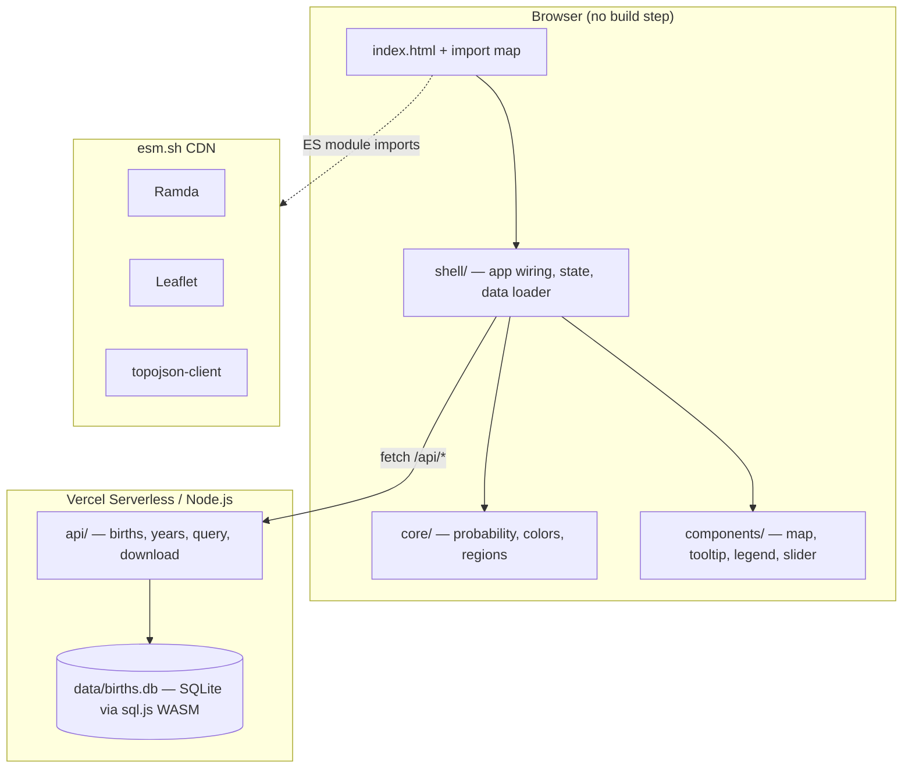

# Birth Probability Map

[](https://map-probability.vercel.app)
[](https://github.com/rtodea/map-probability)

Interactive world heatmap showing where people are most likely to be born, with historical time slider (1950–present), continent/country granularity switching, and mobile-friendly touch interactions.

**Live**: [map-probability.vercel.app](https://map-probability.vercel.app)

## System Overview



## Quick Start

### Option 1: Docker (recommended)

```bash
docker compose up --build
# Open http://localhost:3000
```

### Option 2: Docker without Compose

```bash
docker build -t map-probability .
docker run -p 3000:3000 map-probability
# Open http://localhost:3000
```

### Option 3: Node.js

```bash
npm install
npm run ingest   # downloads birth data → data/births.db (only needed once)
npm run dev      # starts dev server at http://localhost:3000
```

### Option 4: Vercel CLI

```bash
npm install
vercel dev       # starts Vercel dev server with serverless function emulation
```

## Data Pipeline

Birth data is sourced from the [UN World Population Prospects](https://population.un.org/wpp/) (2024 revision). The ingestion script (`scripts/ingest.js`) does the following:

1. **Download** — fetches the UN WPP CSV with annual births by country (falls back to bundled sample data for 40 countries if the URL is unavailable)
2. **Normalize** — maps ISO 3166-1 alpha-3 country codes and assigns continent codes via UN M49 region mapping
3. **Compute** — calculates birth probability per country (births / global total) for each year
4. **Store** — writes everything into `data/births.db`, a SQLite database versioned in the repository (~256 KB)

To re-run ingestion:

```bash
npm run ingest
```

The database covers **1950–2024** with yearly granularity. See [docs/data-model.md](docs/data-model.md) for the full schema.

## API Endpoints

| Method | Route              | Description                                           |
|--------|--------------------|-------------------------------------------------------|
| GET    | `/api/births`      | Birth data by region. Params: `?year=2020&level=country` |
| GET    | `/api/years`       | Available year range (`min_year`, `max_year`, `count`) |
| POST   | `/api/query`       | Execute SELECT queries. Body: `{"sql": "SELECT ..."}` |
| GET    | `/api/download`    | CSV export. Params: `?year=2020&level=country`        |

### UI Routes

| Route            | Description                                    |
|------------------|------------------------------------------------|
| `/`              | Main heatmap application                       |
| `/data/console`  | SQL console for live querying the database      |
| `/data/download` | CSV download (rewrites to `/api/download`)      |

## Vercel Deployment

The project auto-deploys to Vercel on every push to `master`.

| Item              | Value                                                                 |
|-------------------|-----------------------------------------------------------------------|
| **Production URL** | [map-probability.vercel.app](https://map-probability.vercel.app)     |
| **Project**       | `map-probability` in `roberttodea-8986s-projects`                     |
| **Branch**        | `master`                                                              |
| **Node version**  | 24.x                                                                  |
| **Framework**     | None (static `public/` + serverless `api/`)                           |

Static files are served from `public/`. Serverless functions live in `api/` and are auto-detected by Vercel.

## Scripts

| Command          | Description                        |
|------------------|------------------------------------|
| `npm run dev`    | Start local dev server             |
| `npm test`       | Run test suite (31 tests)          |
| `npm run lint`   | Lint all JS files                  |
| `npm run ingest` | Re-download birth data into SQLite |

## Architecture

```
public/            Static frontend (ES modules, no build step)
├── core/          Pure functions (probability, colors, regions)
├── components/    UI components (map, slider, tooltip, legend)
└── shell/         Imperative glue (app wiring, state, data loading)

api/               Vercel serverless functions (also used by local server)
├── lib/db.js      Shared SQLite loader (sql.js WASM)
├── births.js      Birth data endpoint
├── years.js       Year range endpoint
├── query.js       SQL query endpoint
└── download.js    CSV export endpoint

data/              SQLite database (versioned in repo)
scripts/           Data ingestion tooling
docs/              Architecture docs with MermaidJS diagrams
```

Frontend dependencies load from CDN via browser-native import maps — no bundler, no build step.

## Documentation

- [Architecture](docs/architecture.md) — system diagrams, data flow, module dependency graph
- [Data Model](docs/data-model.md) — entity-relationship diagram and schema
- [Documentation Index](docs/index.md) — full table of contents

## Tech Stack

- **Frontend**: Vanilla JS (ES2024+), Leaflet, Ramda — loaded via [esm.sh](https://esm.sh) import maps
- **Backend**: Node.js, sql.js (WASM SQLite)
- **Data**: SQLite database versioned in repo (~256 KB, 1950–2024)
- **Deploy**: Vercel (serverless) or Docker
