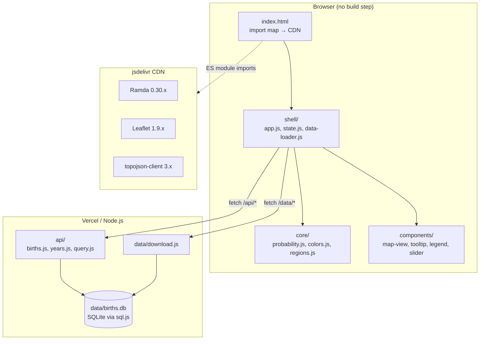
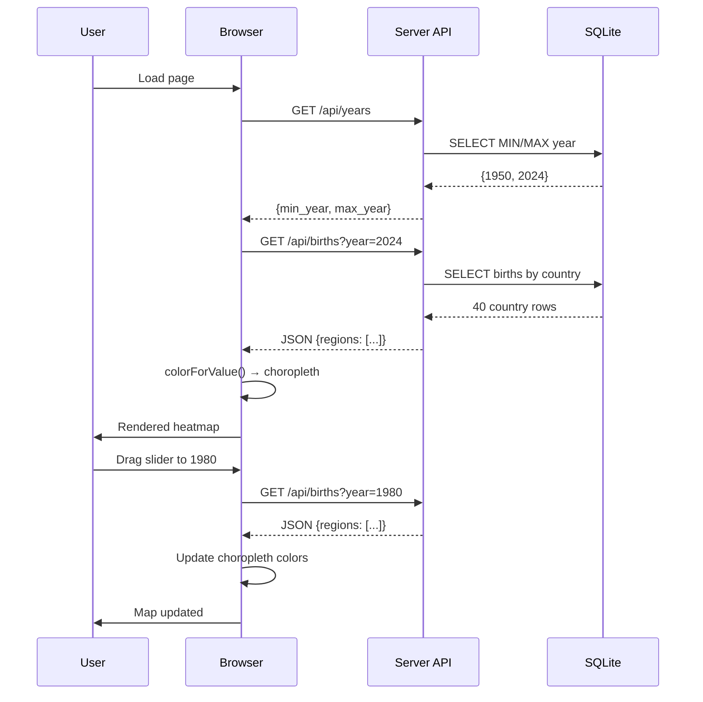
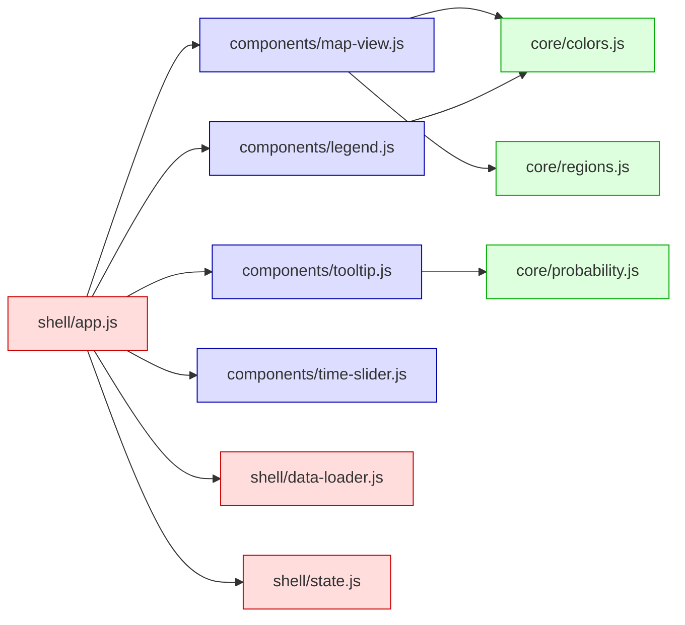

# Architecture — Birth Probability Map

## System Overview

```mermaid
graph TB
    subgraph Browser["Browser (no build step)"]
        HTML["index.html<br/>import map → CDN"]
        Shell["shell/<br/>app.js, state.js, data-loader.js"]
        Core["core/<br/>probability.js, colors.js, regions.js"]
        Components["components/<br/>map-view, tooltip, legend, slider"]
        HTML --> Shell
        Shell --> Core
        Shell --> Components
    end

    subgraph CDN["jsdelivr CDN"]
        Ramda["Ramda 0.30.x"]
        Leaflet["Leaflet 1.9.x"]
        TopoJSON["topojson-client 3.x"]
    end

    subgraph Server["Vercel / Node.js"]
        API["api/<br/>births.js, years.js, query.js"]
        Download["data/download.js"]
        DB[("data/births.db<br/>SQLite via sql.js")]
        API --> DB
        Download --> DB
    end

    HTML -.->|"ES module imports"| CDN
    Shell -->|"fetch /api/*"| API
    Shell -->|"fetch /data/*"| Download
```

## Data Flow

```mermaid
sequenceDiagram
    participant U as User
    participant B as Browser
    participant S as Server API
    participant DB as SQLite

    U->>B: Load page
    B->>S: GET /api/years
    S->>DB: SELECT MIN/MAX year
    DB-->>S: {1950, 2024}
    S-->>B: {min_year, max_year}
    B->>S: GET /api/births?year=2024
    S->>DB: SELECT births by country
    DB-->>S: 40 country rows
    S-->>B: JSON {regions: [...]}
    B->>B: colorForValue() → choropleth
    B->>U: Rendered heatmap

    U->>B: Drag slider to 1980
    B->>S: GET /api/births?year=1980
    S-->>B: JSON {regions: [...]}
    B->>B: Update choropleth colors
    B->>U: Map updated
```

## Module Dependency Graph

```mermaid
graph LR
    app["shell/app.js"] --> mv["components/map-view.js"]
    app --> tt["components/tooltip.js"]
    app --> lg["components/legend.js"]
    app --> ts["components/time-slider.js"]
    app --> dl["shell/data-loader.js"]
    app --> st["shell/state.js"]

    mv --> colors["core/colors.js"]
    mv --> regions["core/regions.js"]
    tt --> prob["core/probability.js"]
    lg --> colors

    style app fill:#fdd,stroke:#c00
    style dl fill:#fdd,stroke:#c00
    style st fill:#fdd,stroke:#c00
    style colors fill:#dfd,stroke:#0a0
    style prob fill:#dfd,stroke:#0a0
    style regions fill:#dfd,stroke:#0a0
    style mv fill:#ddf,stroke:#00a
    style tt fill:#ddf,stroke:#00a
    style lg fill:#ddf,stroke:#00a
    style ts fill:#ddf,stroke:#00a
```

**Legend**: Red = imperative shell, Green = pure functions, Blue = UI components
