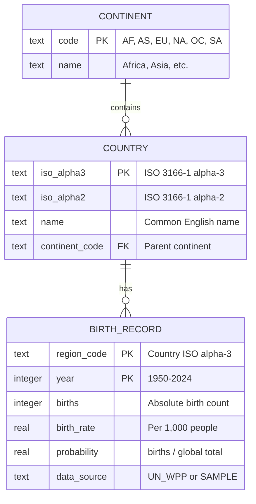

# Data Model — Birth Probability Map

## Entity Relationship Diagram



## Probability Formula

```
probability(region, year) = births(region, year) / SUM(births(all, year))
```

Displayed as percentage: `0.1735 → "17.3%"`

## Views

- **country_births**: Joins birth_record + country + continent for full context
- **continent_births**: Aggregates births by continent with computed probability

## Data Volume

- ~40 countries × 75 years = ~3,000 records (sample data)
- Full UN WPP: ~200 countries × 75 years = ~15,000 records
- SQLite file: 256 KB (sample), estimated < 2 MB (full)
