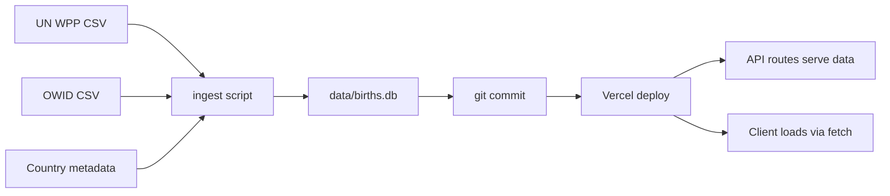

# Data Model: Birth Probability Map

**Date**: 2026-03-17
**Feature**: 001-birth-probability-map

## Entity Relationship Diagram

```mermaid
erDiagram
    CONTINENT ||--o{ COUNTRY : contains
    COUNTRY ||--o{ BIRTH_RECORD : has
    CONTINENT ||--o{ BIRTH_RECORD : "has (aggregated)"

    CONTINENT {
        text code PK "e.g. AF, AS, EU, NA, OC, SA"
        text name "e.g. Africa, Asia, Europe"
    }

    COUNTRY {
        text iso_alpha3 PK "ISO 3166-1 alpha-3"
        text iso_alpha2 "ISO 3166-1 alpha-2"
        text name "Common English name"
        text continent_code FK "Parent continent"
        integer un_m49_code "UN M49 numeric code"
    }

    BIRTH_RECORD {
        text region_code PK "Country ISO alpha-3 or continent code"
        integer year PK "Calendar year (1950–present)"
        integer births "Absolute number of births"
        real birth_rate "Crude birth rate per 1,000"
        real probability "births / global_births for year"
        text data_source "UN_WPP, OWID, ESTIMATED"
    }
}
```

## SQLite Schema

```sql
CREATE TABLE continent (
    code TEXT PRIMARY KEY,
    name TEXT NOT NULL
);

CREATE TABLE country (
    iso_alpha3 TEXT PRIMARY KEY,
    iso_alpha2 TEXT NOT NULL,
    name TEXT NOT NULL,
    continent_code TEXT NOT NULL REFERENCES continent(code),
    un_m49_code INTEGER
);

CREATE TABLE birth_record (
    region_code TEXT NOT NULL,
    year INTEGER NOT NULL,
    births INTEGER,
    birth_rate REAL,
    probability REAL,
    data_source TEXT NOT NULL DEFAULT 'UN_WPP',
    PRIMARY KEY (region_code, year)
);

CREATE INDEX idx_birth_record_year ON birth_record(year);
CREATE INDEX idx_birth_record_region ON birth_record(region_code);

-- View: country births with metadata
CREATE VIEW country_births AS
SELECT
    c.iso_alpha3,
    c.name AS country_name,
    c.continent_code,
    ct.name AS continent_name,
    b.year,
    b.births,
    b.birth_rate,
    b.probability
FROM birth_record b
JOIN country c ON b.region_code = c.iso_alpha3
JOIN continent ct ON c.continent_code = ct.code;

-- View: continent aggregated births
CREATE VIEW continent_births AS
SELECT
    ct.code AS continent_code,
    ct.name AS continent_name,
    b.year,
    SUM(b.births) AS births,
    SUM(b.births) * 1.0 /
        (SELECT SUM(births) FROM birth_record
         WHERE year = b.year) AS probability
FROM birth_record b
JOIN country c ON b.region_code = c.iso_alpha3
JOIN continent ct ON c.continent_code = ct.code
GROUP BY ct.code, b.year;
```

## Probability Calculation

```
probability(region, year) = births(region, year) / total_births(year)

where total_births(year) = SUM(births(all_countries, year))
```

- Probability values are between 0.0 and 1.0
- Displayed as percentages in the UI (e.g., 0.182 → "18.2%")
- Continent probability = sum of its countries' probabilities

## Data Lifecycle



1. **Ingest**: Local Node.js script downloads CSVs, normalizes,
   computes probabilities, writes to `data/births.db`.
2. **Version**: The `.db` file is committed to the repository.
3. **Deploy**: Vercel bundles the `.db` file with the deployment.
4. **Serve**: API routes load `.db` via sql.js and respond to queries.
5. **Client**: Browser can also load `.db` directly for the SQL console.

## Data Volume Estimates

- ~200 countries x 75 years = ~15,000 birth_record rows
- ~6 continents (static metadata)
- ~200 countries (static metadata)
- SQLite file size estimate: < 2 MB
