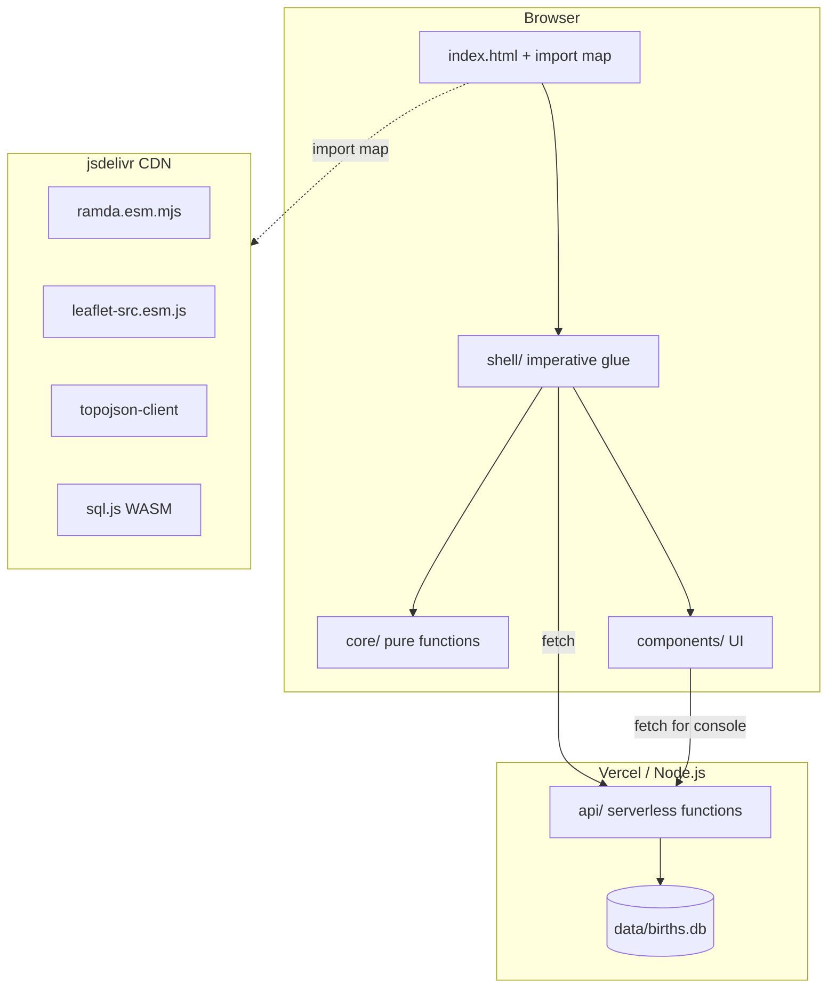

# Quickstart: Birth Probability Map

## Prerequisites

- Node.js 20+ (LTS)
- Git
- Vercel CLI (`npm i -g vercel`) — optional, for preview deploys

## Setup

```bash
git clone https://github.com/rtodea/map-probability.git
cd map-probability
npm install        # installs server-side deps only (sql.js, etc.)
npm run dev        # starts local dev server on http://localhost:3000
```

**No build step.** The frontend loads all dependencies from CDN via
import maps. `npm install` is only needed for the Node.js server
dependencies (sql.js for server-side SQLite queries).

## Project Structure

```text
map-probability/
├── api/                    # Vercel serverless functions
│   ├── births.js           # GET /api/births
│   ├── years.js            # GET /api/years
│   └── query.js            # POST /api/query
├── data/
│   ├── births.db           # SQLite database (versioned)
│   └── download.js         # GET /data/download (Vercel function)
├── public/                 # Static frontend (served as-is)
│   ├── index.html          # Main app entry point + import map
│   ├── console.html        # SQL console page
│   ├── components/         # Pure UI components (ES modules)
│   │   ├── map-view.js     # Leaflet map + choropleth layer
│   │   ├── time-slider.js  # Year selection slider
│   │   ├── tooltip.js      # Region info tooltip
│   │   ├── legend.js       # Color scale legend
│   │   └── sql-console.js  # SQL query interface
│   ├── core/               # Pure functions (functional core)
│   │   ├── probability.js  # Birth probability calculations
│   │   ├── colors.js       # Heatmap color scale mapping
│   │   ├── regions.js      # Region data transformations
│   │   └── query.js        # SQL query helpers
│   ├── shell/              # Imperative glue (side effects)
│   │   ├── app.js          # Main application wiring
│   │   ├── data-loader.js  # Fetch API calls to backend
│   │   └── state.js        # Application state management
│   └── styles/
│       └── main.css        # Responsive layout styles
├── scripts/                # Data management
│   └── ingest.js           # Download + import birth data to SQLite
├── docs/                   # Literate programming docs
│   ├── architecture.md     # System overview + MermaidJS diagrams
│   ├── data-model.md       # Entity docs + ER diagram
│   └── index.md            # Documentation table of contents
├── server.js               # Local dev server (plain Node.js)
├── vercel.json             # Vercel configuration
└── package.json            # Server deps + scripts (type: "module")
```

## Key Commands

| Command               | Description                              |
|-----------------------|------------------------------------------|
| `npm run dev`         | Start local development server           |
| `npm run ingest`      | Download latest birth data into SQLite   |
| `npm test`            | Run test suite                           |
| `npm run lint`        | Lint all JS files                        |
| `vercel dev`          | Local preview with Vercel function emulation |
| `vercel`              | Deploy to preview                        |

## Architecture Overview



## Local Development Flow

1. `npm run dev` starts a plain Node.js HTTP server.
2. It serves `public/` as static files and routes `/api/*` and
   `/data/*` to the corresponding handler modules.
3. The browser loads `index.html`, which declares the import map
   pointing to CDN URLs for Ramda, Leaflet, etc.
4. ES module `<script type="module">` imports boot the app.
5. The app fetches birth data from `/api/births` and renders the map.

## Updating Birth Data

```bash
npm run ingest          # downloads latest CSVs, writes to data/births.db
git add data/births.db
git commit -m "data: update birth data to 2024"
git push                # triggers Vercel redeploy with new data
```

## Vercel Deployment

The project deploys to Vercel without a build step:

- `public/` → served as static assets
- `api/` → serverless functions (Node.js runtime)
- `data/births.db` → bundled with serverless functions
- `vercel.json` → routes `/data/download` and `/data/console`
  to appropriate handlers
